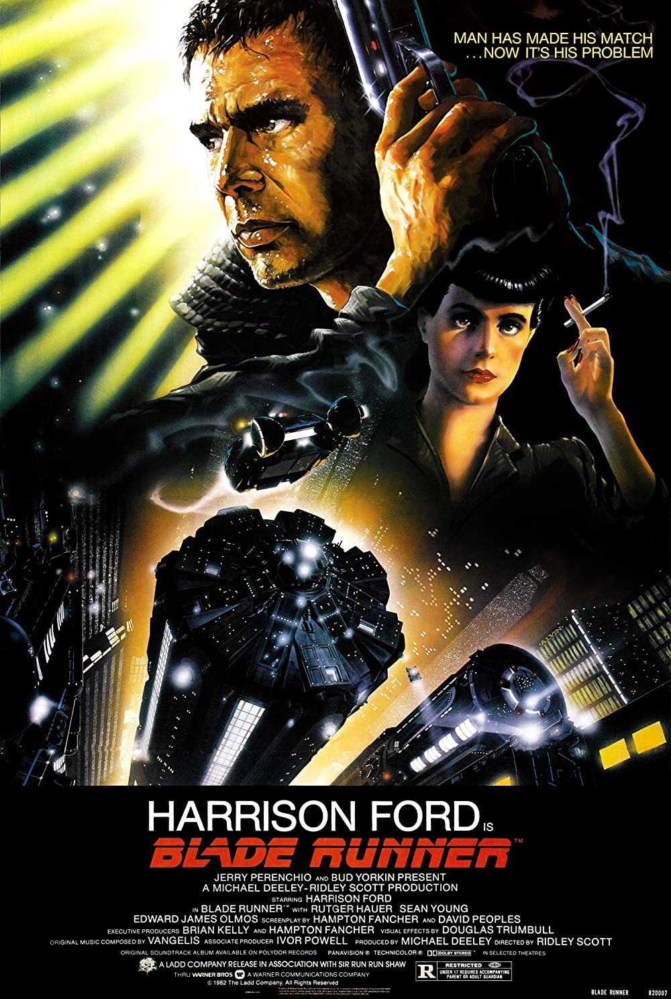

                For searching

                
                

                    <h3>Blade Runner</h3>
                    <i class="fa-solid fa-star"></i>
                    
8.1

                

                

                    
117 min

                    
Action,Drama,Sci-fi

                    <button class="add-to-watchlist" id="add-to-watchlist"><i class="fa-solid fa-circle-plus"></i>Watchlist</button>
                

                

                    
A blade runner must pursue and terminate four replicants who stole a ship in space, and have returned to Earth to find their creator.

                

                For watchlist

                For watchlist

                
                

                    <h3>Blade Runner</h3>
                    <i class="fa-solid fa-star"></i>
                    
8.1

                

                

                    
117 min

                    
Action,Drama,Sci-fi

                    <button class="add-to-watchlist" id="add-to-watchlist"><i class="fa-solid fa-circle-minus"></i>Watchlist</button>
                

                

                    
A blade runner must pursue and terminate four replicants who stole a ship in space, and have returned to Earth to find their creator.

                

           what i want for index.html
1.If the page first loads I want to be already displaying the div with the class movie-container-background
2. I want the the text-content of search-message to change  to "No results found. Try a different search." if what was searched doesn't exist
3.If the search exists, I want to change the height of the main tag to 100% and also use the content of the above to fill into the section with the id and also the div with the class movie-container-background to display none

            what i want for watchlist.html
1. If the page first loads, I want to be already displaying the div with the class movie-container-background
2. When something is added, I want the main tag to be 100% and also div with the class movie-container-background to be display none
1.When the add-to-watchlist button is pressed, I want ot add that movie to my local storage and have it display at the watchlist.html .
2. I also want to add a remove btn for the watchlist.html so that when it is pressed, it removes the movie from local storage and also from watchlist.html

                
                

                    <h3>Blade Runner</h3>
                    <i class="fa-solid fa-star"></i>
                    
8.1

                

                

                    
117 min

                    
Action,Drama,Sci-fi

                    <button class="add-to-watchlist" id="add-to-watchlist"><i class="fa-solid fa-circle-minus"></i>Watchlist</button>
                

                

                    
A blade runner must pursue and terminate four replicants who stole a ship in space, and have returned to Earth to find their creator.

                

            
